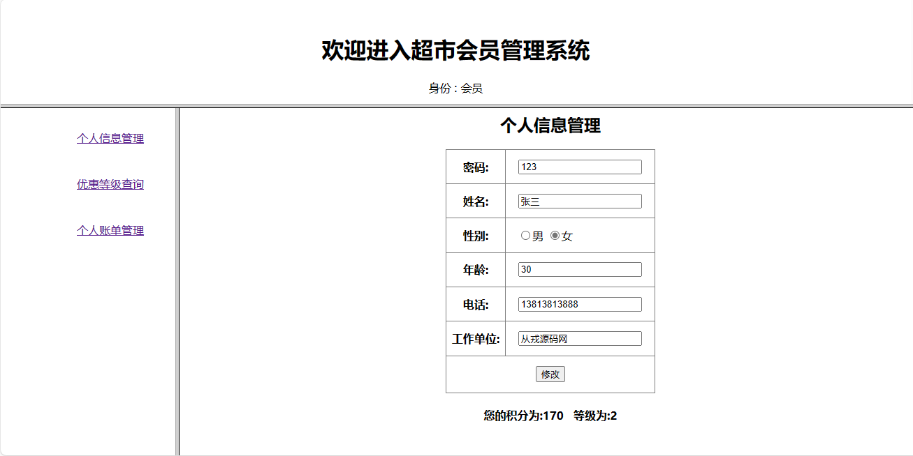
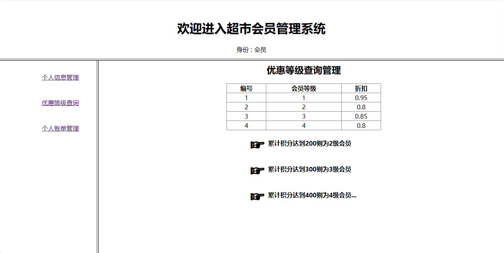
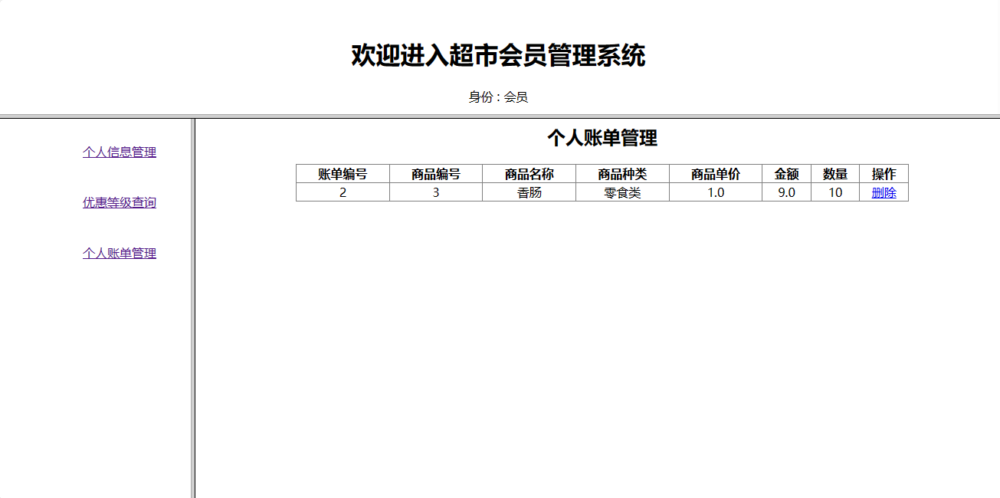
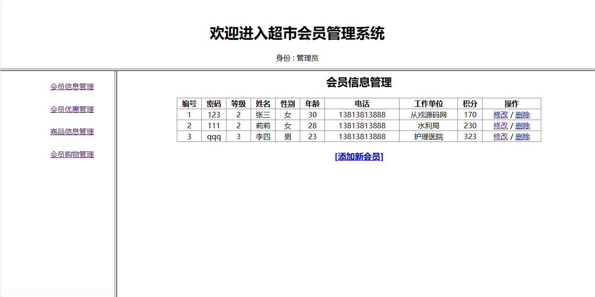
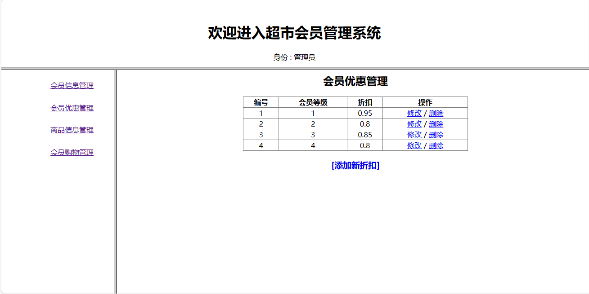
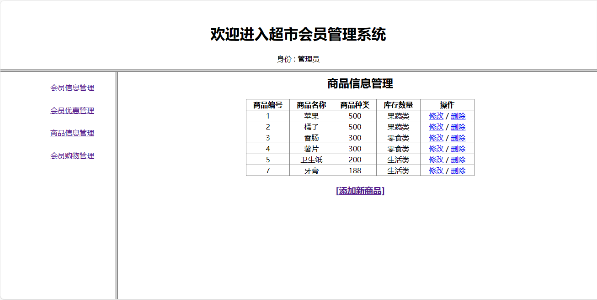
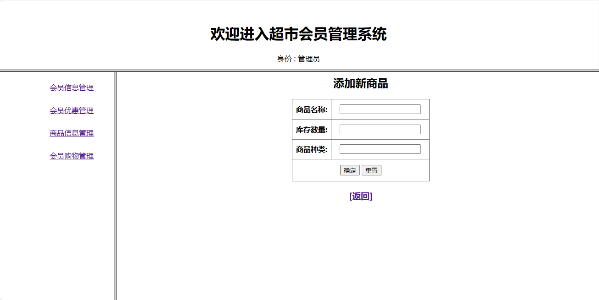

<h1 align="center">33.基于jsp+servlet超市会员管理系统</h1>

- <b>完整代码获取地址：从戎源码网 ([https://armycodes.com/](https://armycodes.com/))</b>
- <b>技术探讨、资料分享，请加QQ群：692619798</b> 
- <b>作者微信：19941326836  QQ：952045282</b> 
- <b>承接计算机毕业设计、Java毕业设计、Python毕业设计、深度学习、机器学习</b>
- <b>选题+开题报告+任务书+程序定制+安装调试+论文+答辩ppt 一条龙服务</b>
- <b>所有选题地址 ([https://github.com/YuLin-Coder/AllProjectCatalog](https://github.com/YuLin-Coder/AllProjectCatalog)) </b>

## 项目介绍

基于jsp+servlet超市会员管理系统：前端 jsp，后端 servlet，线程池c3p0，集成会员信息、会员优惠、商品信息、会员购物等功能系统，系统角色分为会员和超市管理员。

## 主要功能

### 管理员

- 会员信息管理：会员信息列表、会员信息修改、会员信息删除、添加新会员
- 会员优惠管理：会员优惠列表、添加新折扣、折扣信息修改、折扣信息删除
- 商品信息管理：商品信息列表、商品信息修改、商品信息删除、添加新商品
- 会员购物管理：会员购物记录列表、查看详情账单

### 会员

- 个人信息管理：个人信息查看、个人信息修改、积分和等级查看
- 优惠等级查询：会员优惠等级列表、对应折扣、等级所需积分
- 个人账单管理：个人账单列表、个人账单记录删除

## 环境

- <b>IntelliJ IDEA</b>

- <b>Mysql 5.7</b>

- <b>Tomcat 9.x</b>

- <b>JDK 1.8</b>

## 运行截图

